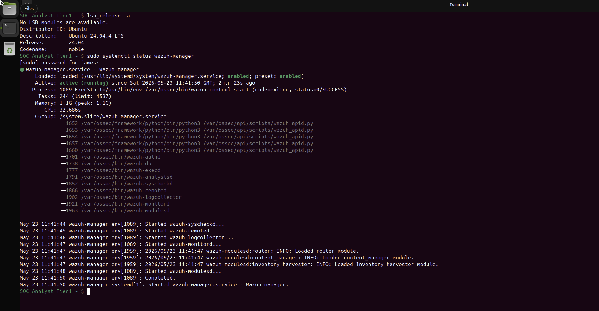
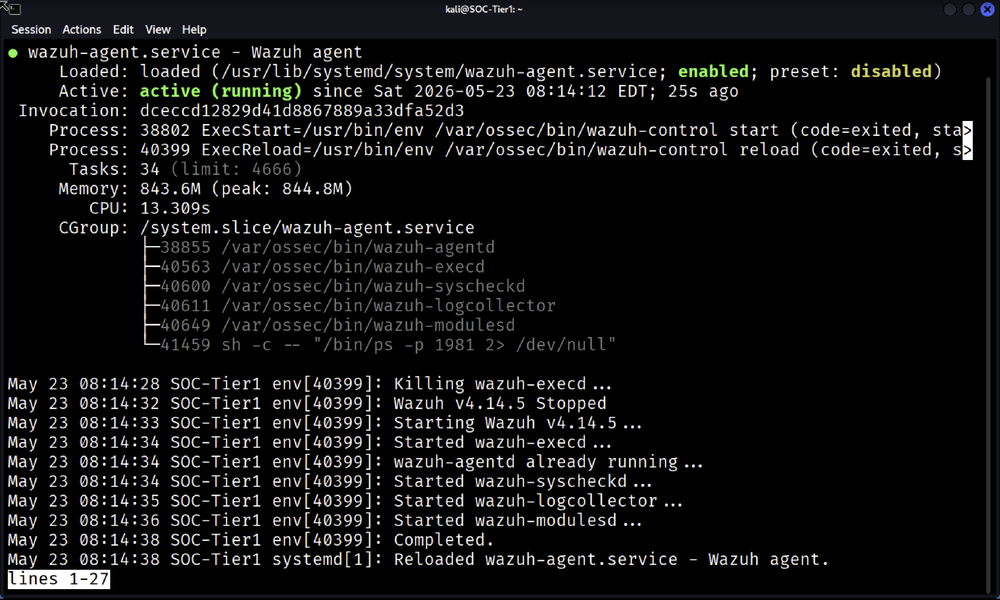
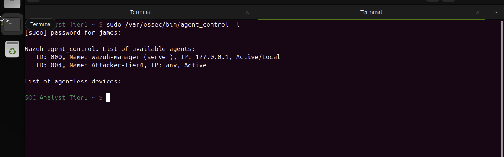
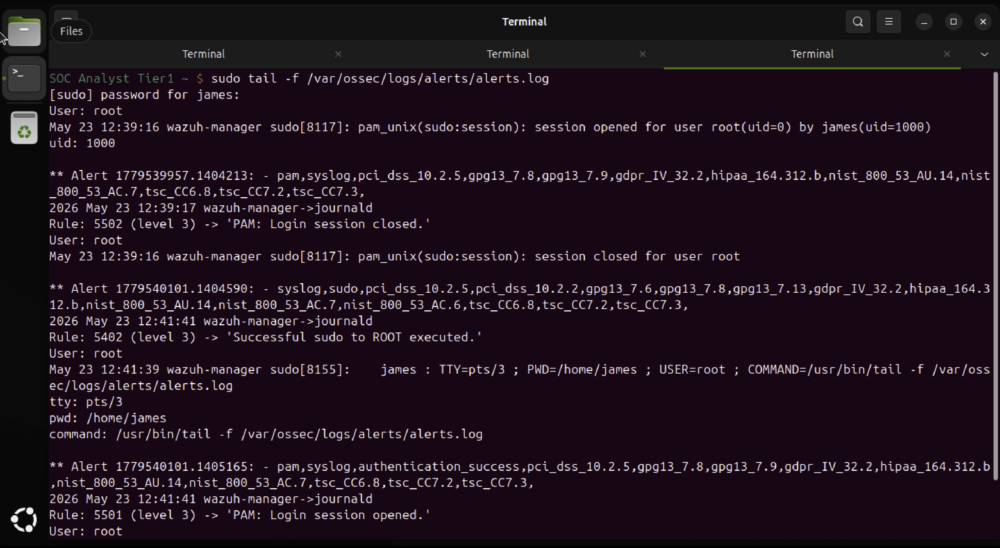
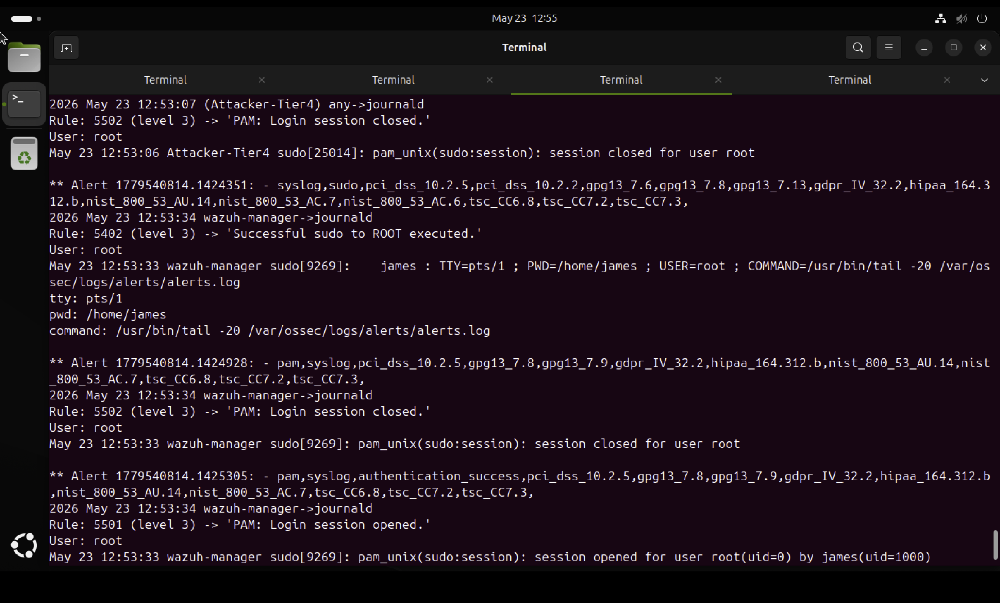
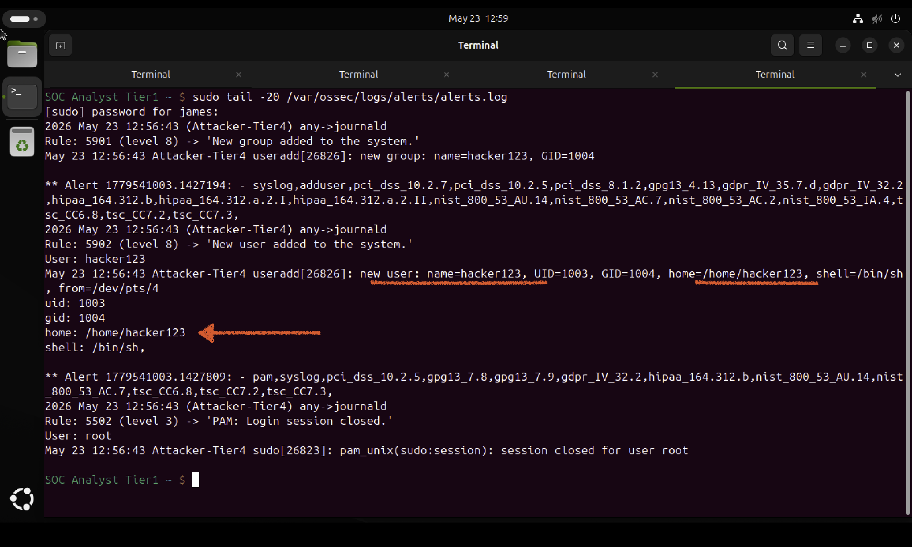
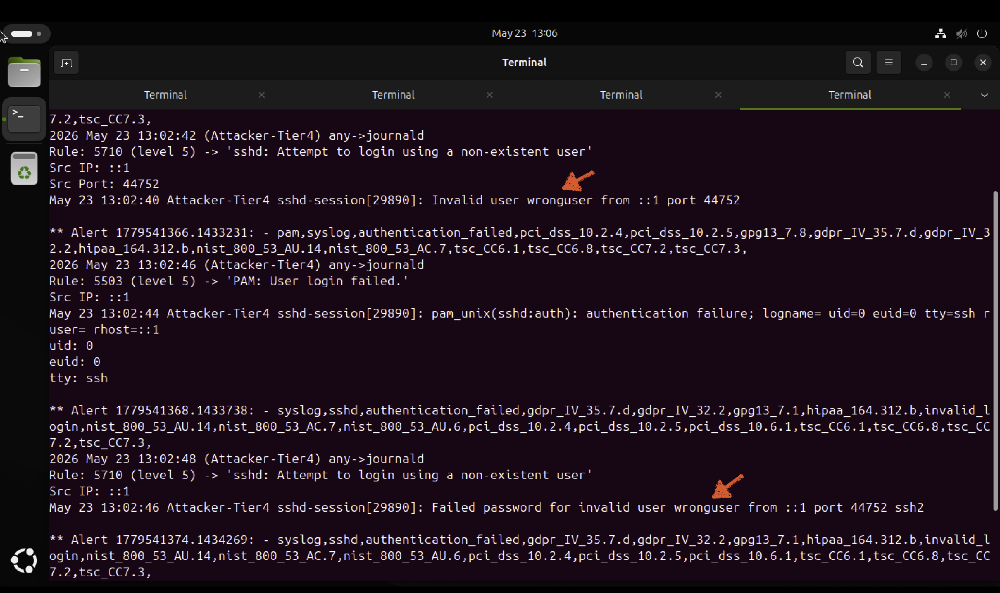

# Day 21 – SOC Tier 1 Incident Report: EDR Wazuh Endpoint Detection Lab

---

## Incident Summary

- **Incident Type:** Endpoint Detection & Response Suspicious Activity Simulation
- **Severity:** High Unauthorized User Creation + SSH Brute Force Detected
- **Detection Method:** Wazuh EDR Agent Monitoring + Real-Time Alert Log Analysis
- **Tools Used:** Wazuh Manager, Wazuh Agent, Ubuntu Server, Kali Linux
- **Status:** Complete All Threats Detected and Documented

---

## Executive Summary

A Wazuh EDR lab was deployed across a two machine environment Wazuh manager on Ubuntu Server and a Wazuh agent on Kali Linux (Attacker-Tier4). Real suspicious activity was generated on the Kali endpoint and monitored in real time through the Wazuh alerts log on the Ubuntu manager. Three categories of malicious activity were detected privilege escalation via sudo, unauthorized user account creation, and SSH brute force attempts using a non existent user. All alerts were captured, documented, and mapped to MITRE ATT&CK techniques.

---

## Affected System

- **Wazuh Manager:** Ubuntu Server 192.168.64.12
- **Monitored Endpoint:** Kali Linux Attacker-Tier4 (ID: 004)
- **Agent Status:** Active Connected
- **Alert Log:** /var/ossec/logs/alerts/alerts.log
- **Wazuh Version:** 4.x

---

## Investigation Methodology

---

### 1. Wazuh Manager Running Service Verified



- Confirmed wazuh manager service active and running on Ubuntu Server
- Service enabled on system startup
- Manager memory usage confirmed at 1.1G healthy state

#### SOC Observations:

- Always verify EDR manager service status before beginning an investigation
- A stopped manager means no alerts are being collected a critical blind spot
- Memory usage indicates active processing of agent telemetry

---

### 2. Wazuh Agent Deployed on Kali Linux



- Wazuh agent installed on Kali Linux (Attacker-Tier4)
- Agent configured to connect to manager at 192.168.64.12
- Agent status confirmed as active and running
- Agent registered as ID 004 on the Wazuh manager

#### SOC Observations:

- EDR agents are the eyes on every endpoint without them the manager is blind
- Agent registration ties the endpoint identity to the manager for attribution
- In a real SOC every endpoint must have an active EDR agent unmonitored hosts are a risk

---

### 3. Agent Connected and Active on Manager



- Confirmed agent ID 004 Attacker-Tier4 showing as Active on manager
- All previous disconnected agents removed for clean environment
- Manager now monitoring one active endpoint

#### SOC Observations:

- Regular audit of connected agents is a SOC best practice
- Disconnected agents represent unmonitored endpoints high risk
- Stale agents should be removed to keep the environment clean and accurate

---

### 4. Live Alert Log Real-Time Monitoring Active



- Opened /var/ossec/logs/alerts/alerts.log on Ubuntu Server
- Confirmed real-time alert stream active
- Initial alerts captured from wazuh-manager itself
- Baseline established before suspicious activity generation

#### SOC Observations:

- The alerts log is the primary investigation tool when no dashboard is available
- Real SOC analysts read raw logs dashboard proficiency matters but log reading is fundamental
- Timestamp correlation between manager and agent events is critical for accurate timelines

---

### 5. Kali Endpoint Activity Detected First Alerts



- Confirmed Attacker-Tier4 events appearing in the alerts log
- Sudo privilege escalation detected Rule 5402 level 3
- PAM session opened and closed events captured
- Agent successfully forwarding endpoint telemetry to manager

#### SOC Observations:

- Sudo usage on an endpoint is a tier 1 SOC alert always warrants investigation
- PAM session events create an audit trail of every login and privilege escalation
- Agent-to-manager telemetry confirms end-to-end EDR coverage is working

---

### 6. Critical Alert Unauthorized User Account Created



- Simulated attacker created user account `hacker123` on Kali endpoint
- Wazuh fired immediately:
  - **Rule 5901 (level 8)** "New group added to the system"
  - **Rule 5902 (level 8)** "New user added to the system"
- Full details captured: UID=1003, GID=1004, home=/home/hacker123
- Level 8 severity high priority alert requiring immediate investigation

#### SOC Observations:

- Unauthorized user creation is a classic persistence technique attackers create accounts to maintain access
- Level 8 in Wazuh means high severity this alert should trigger an immediate response
- Full UID and home directory details allow the IR team to quickly locate and remove the account
- In a real incident this would trigger host isolation and forensic investigation

---

### 7. SSH Brute Force Detected from Kali Endpoint



- Simulated brute force using repeated SSH attempts with invalid user `wronguser`
- Wazuh detected and alerted on every attempt:
  - **Rule 5503 (level 5)** "PAM: User login failed"
  - **Rule 5710 (level 5)** "sshd: Attempt to login using a non-existent user"
- Source IP identified as ::1 (localhost) internal attack simulation
- Multiple attempts captured with timestamps confirming brute force pattern

#### SOC Observations:

- SSH brute force is one of the most common attack techniques Rule 5710 is a critical detection
- Repeated failed logins in rapid succession confirm automated brute force not human error
- In a real environment this would trigger an IP block and account lockout investigation

---

## Alert Summary

| Rule | Level | Alert | Source | Severity |
|---|---|---|---|---|
| 5402 | 3 | Successful sudo to ROOT executed | Attacker-Tier4 | Medium |
| 5501 | 3 | PAM: Login session opened | Attacker-Tier4 | Low |
| 5502 | 3 | PAM: Login session closed | Attacker-Tier4 | Low |
| 5901 | 8 | New group added to the system | Attacker-Tier4 | High |
| 5902 | 8 | New user added to the system — hacker123 | Attacker-Tier4 | High |
| 5503 | 5 | PAM: User login failed | Attacker-Tier4 | Medium |
| 5710 | 5 | sshd: Attempt to login using a non-existent user | Attacker-Tier4 | Medium |

---

## IOC Table

| Type | Value | Verdict |
|---|---|---|
| Endpoint | Attacker-Tier4 | ❌ Suspicious activity detected |
| User Created | hacker123 (UID 1003) | ❌ Unauthorized account persistence attempt |
| Failed SSH User | wronguser | ❌ Brute force target username |
| Privilege Action | sudo to ROOT | ⚠️ Privilege escalation investigate |

---

## MITRE ATT&CK Mapping

| Technique ID | Technique | Alert |
|---|---|---|
| T1078 | Valid Accounts | Unauthorized user hacker123 created |
| T1136.001 | Create Account: Local Account | Rule 5902 new user added |
| T1548.003 | Abuse Elevation: Sudo | Rule 5402 sudo to ROOT |
| T1110.001 | Brute Force: Password Guessing | Rule 5710 SSH invalid user attempts |
| T1021.004 | Remote Services: SSH | SSH brute force via port 44752 |

---

## SOC Analyst Findings

- Wazuh EDR successfully deployed across Ubuntu Server and Kali Linux endpoint
- All suspicious activity generated on Kali was detected and alerted in real time
- Unauthorized user account `hacker123` created persistence technique detected Rule 5902 level 8
- SSH brute force attempts detected 10 failed attempts for invalid user `wronguser`
- Privilege escalation via sudo detected Rule 5402
- All alerts captured with timestamps, source host, and rule details

---

## SOC Analyst Response

- Unauthorized user `hacker123` deleted from Kali endpoint immediately
- SSH brute force source identified and documented
- All alert rules mapped to MITRE ATT&CK for threat intelligence value
- Full alert timeline documented for IR handoff
- Recommended enabling Wazuh active response to auto block brute force IPs
- Recommended deploying agents to all endpoints in the lab environment

---

## Analyst Insight

EDR tools like Wazuh transform an endpoint from a blind spot into a detection surface. Every sudo command, every new user, every failed login all of it becomes a data point that a SOC analyst can pivot on. The most valuable moment in this lab was watching Rule 5902 fire in real time the instant `hacker123` was created. That is exactly what Tier 1 analysts see when an attacker establishes persistence on a compromised endpoint. Speed of detection is everything and EDR is what makes that speed possible.

---

## Learning Outcome

- Deploy Wazuh manager and agent across a multi machine lab environment
- Connect and verify Wazuh agent telemetry from a monitored endpoint
- Generate real suspicious activity and observe Wazuh detection in real time
- Read and interpret raw Wazuh alert logs without a dashboard
- Identify persistence techniques unauthorized user creation via EDR alerts
- Detect SSH brute force patterns through Wazuh rule 5710
- Map all detected activity to MITRE ATT&CK framework
- Produce a professional EDR incident report from raw log evidence

---

## Repository Structure

```
edr-wazuh-endpoint-detection-lab/
├── README.md
└── screenshots/
    ├── 01_wazuh_manager_running.png
    ├── 02_wazuh_agent_running.png
    ├── 03_agent_connected.png
    ├── 04_alerts_log_live.png
    ├── 05_kali_alerts_detected.png
    ├── 06_user_creation_alert.png
    └── 07_ssh_brute_force_alerts.png
```

---

## Conclusion

This lab demonstrates a complete EDR deployment and endpoint detection workflow using Wazuh. A manager was configured on Ubuntu Server and an agent deployed on Kali Linux. Real suspicious activity was generated privilege escalation, unauthorized user creation, and SSH brute force and all events were detected and alerted in real time through the Wazuh alerts log. MITRE ATT&CK techniques were mapped and a full incident report was produced. This mirrors the exact process a SOC Tier 1 analyst follows when investigating endpoint alerts from an EDR platform.
