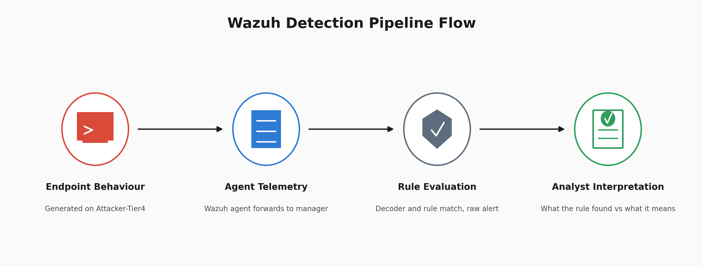
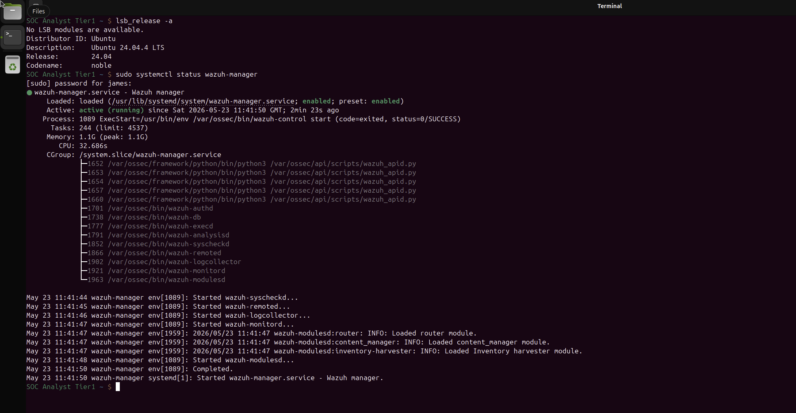
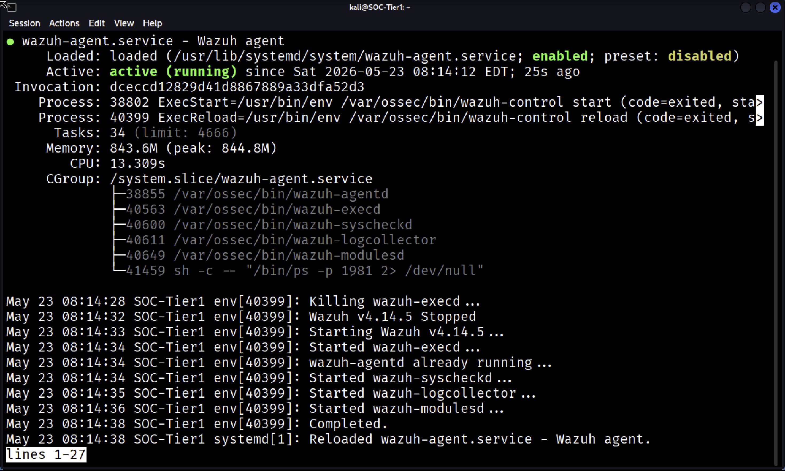
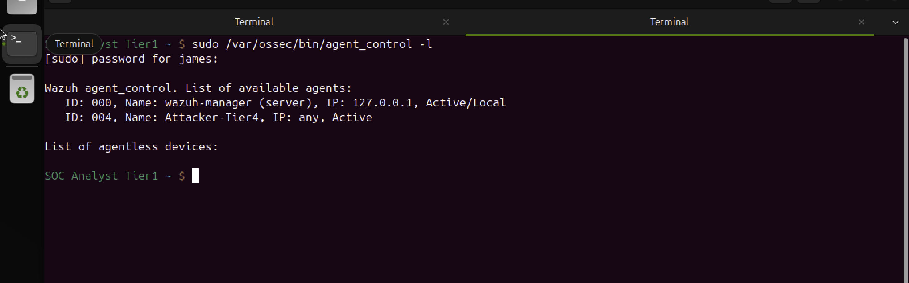
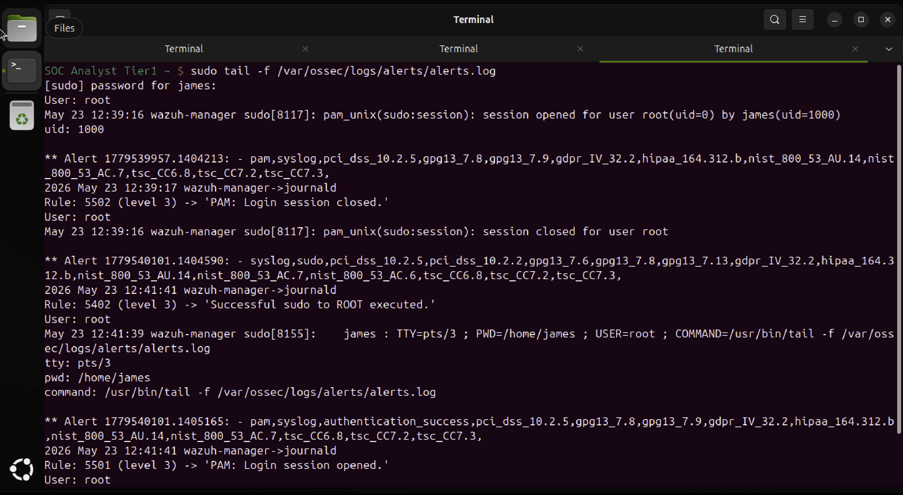
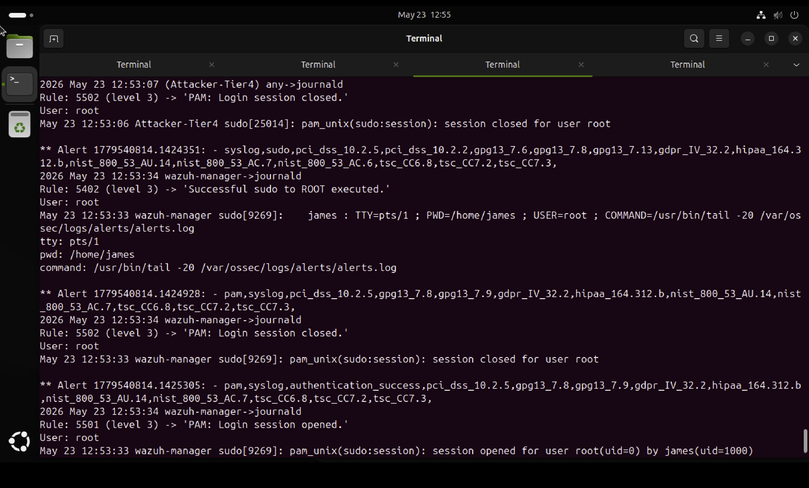
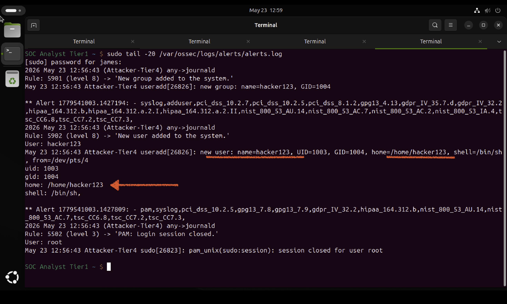
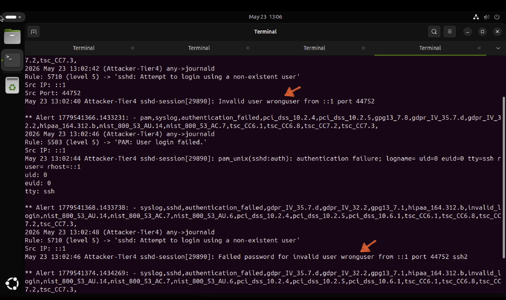

# Wazuh Endpoint Detection and Alert Investigation Lab

Deploying Wazuh across a manager and an agent, then generating real behaviour on the endpoint and watching the rules fire in the raw alert log. No dashboard.



## At a Glance

| Field | Detail |
| --- | --- |
| Build Type | Endpoint detection and alert investigation |
| Manager | Wazuh v4.14.5 on Ubuntu Server 24.04.4 LTS, 192.168.64.12 |
| Endpoint | Kali Linux, registered as Attacker-Tier4, agent ID 004 |
| Alert Source | /var/ossec/logs/alerts/alerts.log |
| Generated | Unauthorised account creation, SSH auth failures against a non existent user |
| Outcome | Both generated categories fired on the endpoint, manager side sudo activity also captured, evidence and rule limits documented |

## What Happened

A Wazuh manager was stood up on Ubuntu with an agent on a Kali endpoint. Three categories of behaviour were then generated on that endpoint and watched arriving at the manager live.

Everything was read from the raw alert log rather than a dashboard. That was deliberate. A dashboard tells you a rule fired. The log tells you what the rule actually saw, and the day the dashboard is down or the rule is wrong, the log is the only thing left.

This lab validates the detection pipeline itself, endpoint behaviour through Linux telemetry, the Wazuh agent, the manager's decoder and rule evaluation, into a raw alert an analyst then has to interpret. It demonstrates detection and alerting. It does not demonstrate response, no process was killed, no host was isolated, no active response rule fired, that stays in What I Would Improve rather than in the results.

Scope stated plainly: the attack activity is self generated on a lab host, and the SSH activity runs over loopback. The rules, the rule IDs, and the alerts are real Wazuh output.

## Manager Verification



Service confirmed active and enabled at startup, memory usage consistent with active processing, Ubuntu 24.04.4 LTS confirmed via lsb_release.

Check the manager before trusting anything downstream. A stopped manager does not produce an error, it produces silence, and silence looks exactly like a quiet network.

## Agent Deployment



Agent installed on the Kali endpoint, pointed at the manager, confirmed active. Startup log confirms Wazuh v4.14.5.

The agent is the visibility. A host without one is not a low risk host, it is an unknown one.

## Agent Connectivity



agent_control confirms agent 004 registered under the name Attacker-Tier4, status Active. Stale disconnected agents removed so the inventory reflects reality.

An agent list full of disconnected entries is worse than an empty one. It means nobody knows which endpoints are actually covered, and coverage you cannot state is coverage you do not have.

## Baseline



Alert log opened and confirmed streaming. Initial alerts from the manager itself captured. Baseline taken before any attack activity.

Baseline first. Without knowing what the log looks like quiet, there is no way to say what the attack added.

## Sudo and PAM Session Activity



Two different sources appear in this capture, worth separating rather than treating as one thing.

Rule 5502, level 3, PAM login session closed, source Attacker-Tier4. This is genuinely endpoint telemetry, a sudo session on the Kali agent was opened and closed and Wazuh logged both.

Rule 5402, level 3, successful sudo to ROOT executed, source wazuh-manager, not the endpoint. The command captured in the alert is the analyst's own `sudo tail -20 /var/ossec/logs/alerts/alerts.log`, reading the log on the manager itself. This is the manager logging its own administrative activity, not attack simulation on the endpoint, and it is worth keeping in the writeup for exactly that reason. Routine, legitimate sudo use by the person running the lab still got captured with full command, TTY, and working directory, which says something honest about how much visibility this pipeline actually has, more than the endpoint attack narrative alone would show.

Sudo activity itself, wherever it originates, proves sudo was used. It does not by itself prove malicious escalation, level 3 is Wazuh's default classification for this event type regardless of who ran it or why.

## Detection, Unauthorised Account Creation



A user account, hacker123, was created on the endpoint, Attacker-Tier4.

Wazuh fired immediately:

Rule 5901, level 8, new group added to the system.

Rule 5902, level 8, new user added to the system.

Full detail captured: UID 1003, GID 1004, home /home/hacker123, shell /bin/sh.

Observed: a local account was created and Wazuh detected it in real time with full identifying detail. Account creation is a behaviour consistent with T1136.001, Create Account, Local Account, and is exactly the kind of action an attacker establishing persistence would take. This lab does not establish that persistence was the actual intent, the account was deliberately created by the person running the lab to generate this alert, not by an adversary. What the evidence supports is narrower and still valuable: unexpected account creation outside an approved administrative context is the kind of event that deserves investigation, and this pipeline catches it with enough detail, UID and home directory included, to act on immediately.

Level 8 is the reason the detail matters regardless of intent. The alert does not just say something happened, it hands the responder the UID and the home directory, which is what is needed to find and remove the account without a separate forensic pass.

## Detection, SSH Authentication Against a Non Existent User



Repeated SSH attempts using a non existent user, wronguser.

Rule 5503, level 5, PAM user login failed.

Rule 5710, level 5, sshd attempt to login using a non existent user.

Source ::1, loopback, confirming the lab origin.

Observed: repeated failed SSH authentication against an account that does not exist, captured as two related but distinct alerts. Rule 5503 is a generic PAM authentication failure. Rule 5710 specifically flags that the targeted username was never valid, which is a meaningfully different signal, a failed password against a real account and a failed attempt against an account that never existed are not the same event even though both look like SSH noise in a dashboard summary.

What this does not establish is intent or automation. An invalid username attempt can come from genuine enumeration, a typo, stale automation pointed at an old account name, misconfiguration, a scanner working through a generic username list, or password guessing against a list that happened to include a bad username. The captured alerts show the pattern, repeated attempts against a name that never existed, they do not show which of those explanations is correct. Enumeration is a reasonable hypothesis worth carrying into an investigation. It is a hypothesis, not a conclusion this evidence alone supports.

## Alert Summary

| Rule | Level | Alert | Source |
| --- | --- | --- | --- |
| 5402 | 3 | Successful sudo to root | wazuh-manager, analyst's own log review command |
| 5501 | 3 | PAM login session opened | Attacker-Tier4 |
| 5502 | 3 | PAM login session closed | Attacker-Tier4 |
| 5503 | 5 | PAM user login failed | Attacker-Tier4 |
| 5710 | 5 | sshd attempt to login using a non existent user | Attacker-Tier4 |
| 5901 | 8 | New group added to the system | Attacker-Tier4 |
| 5902 | 8 | New user added to the system, hacker123 | Attacker-Tier4 |

## Observations

| Type | Value | Verdict |
| --- | --- | --- |
| Endpoint | Attacker-Tier4 | Generated activity detected |
| Account created | hacker123, UID 1003 | Behaviour consistent with persistence, intent not established in this lab |
| Failed SSH user | wronguser | Non existent, enumeration is a hypothesis, not confirmed |
| Privilege action | sudo to root, rule 5402 | Manager side administrative activity, not endpoint attack behaviour |
| Source | ::1, loopback | Lab origin, self generated |

## MITRE ATT&CK Mapping

| Tactic | Technique | ID | Rule | Note |
| --- | --- | --- | --- | --- |
| Persistence | Create account, local account | T1136.001 | 5902 | Behaviour consistent with the technique, intent not independently established |
| Credential Access | Brute force | T1110 | 5503 | Genuine password failure against a real account, fits the parent technique |

Mapping note: rule 5710 is deliberately left off this table at the T1110.001 Password Guessing level. Guessing a password assumes a known or assumed valid account, and 5710 fires specifically because the account was never valid, that is closer to account discovery or enumeration than password guessing, and forcing it into T1110.001 would erase the exact distinction the SSH section above is making. T1078 valid accounts is also not mapped, because the created account was never used to authenticate. T1548.003, Abuse Elevation Control Mechanism via sudo, is also not mapped, rule 5402 is kept in the investigation write up because it is a genuinely useful lesson, but it captured the analyst's own administrative command on the manager, not generated endpoint attack behaviour, so it does not belong in a table of techniques this lab actually observed on the endpoint.

## Analyst Findings

Wazuh deployed across manager and endpoint, telemetry confirmed flowing end to end.

The endpoint generated account creation and invalid user SSH authentication alerts in real time. Separate manager side sudo activity was also captured in the same raw alert stream.

Unauthorised account hacker123 detected on creation, rule 5902, level 8, with UID and home directory captured, behaviour consistent with persistence though intent was not independently established.

Repeated SSH authentication failures against a non existent user detected, rule 5710, evidence supports invalid account attempts, enumeration is a hypothesis the alert alone does not confirm.

Sudo to root detected, rule 5402, this specific instance traced to the manager's own administrative activity rather than the endpoint, which is itself a useful data point about how much this pipeline actually captures.

Every alert carries timestamp, source host, and rule ID, which is what makes them usable rather than just visible.

## Recommended Response

Remove the unauthorised account and check for anything it owns.

Alert specifically on rule 5902, and review account creation events outside an approved administrative context, since legitimate provisioning, configuration management, and installers can all create accounts too and a rule this useful is worth tuning rather than treating every hit as confirmed malicious.

Deploy agents to every endpoint. Partial coverage is a map with holes in it that looks complete.

Audit the agent list on a schedule so disconnected agents surface before an incident does.

## What This Lab Demonstrates

Deploying an EDR manager and agent across a multi machine environment and verifying telemetry end to end.

Reading raw alert logs rather than depending on a dashboard.

Establishing a baseline before generating any activity.

Recognising account creation as behaviour consistent with persistence, and being precise about the difference between that and confirmed persistence intent.

Distinguishing a generic authentication failure from a non existent user attempt by which specific rule fires.

Mapping detections to ATT&CK by rule ID, leaving out a subtechnique that does not actually fit, and leaving out a technique that was not observed at all.

## Lessons Learned

The through line across all three findings in this lab is the same one: a rule firing correctly does not mean every conclusion drawn from the alert is correct.

Rule 5710 correctly detected an SSH attempt against a username that never existed. It did not say why that username was attempted, enumeration, a typo, and stale automation all produce the identical alert.

Rule 5902 correctly detected a new local account. It did not say why the account was created, this lab's own account was created deliberately to generate the alert, not by an adversary establishing a foothold.

Rule 5402 correctly detected a successful sudo to root. It turned out to be the analyst's own command to read the log, not endpoint attack behaviour at all, caught only because the screenshot evidence was actually checked line by line rather than assumed to match the section it was placed under.

The rule doing its job and the analyst's interpretation of what the rule found are two separate things, and the gap between them is exactly where an alert becomes either a fast, correct escalation or a false narrative that happens to have real telemetry attached to it.

## What I Would Improve

I would test Wazuh's correlation rule 5712, which is documented to trigger after repeated rule 5710 matches from the same source within a short window, roughly eight attempts inside two minutes per Wazuh's own testing documentation, though that exact threshold is worth confirming against the installed ruleset rather than assumed. The actual experiment: generate a controlled run of invalid user SSH attempts at that volume, document the hypothesis beforehand, capture whether 5712 actually fires, and record the real result rather than treating correlation coverage as proven because a single 5710 fired once. That is the natural next hands on step for this lab, and it would turn "I generated SSH activity and Wazuh caught it" into an actual tuning result with a threshold, an expected outcome, and a measured one.

I would configure and test Active Response, specifically firewall-drop tied to repeated SSH failures, and capture the block actually happening, rather than leaving automated response as a description of what Wazuh supports.

I would re-run the sudo generation step and confirm capturing a genuine Attacker-Tier4 sourced rule 5402 alongside the manager sourced one already in evidence, so the privilege escalation section has an actual endpoint example rather than only the administrative one.

## Repository Structure

```text
.
└── screenshots/
    ├── 00_architecture.png
    ├── 01_wazuh_manager_running.png
    ├── 02_wazuh_agent_running.png
    ├── 03_agent_connected.png
    ├── 04_alerts_log_live.png
    ├── 05_kali_alerts_detected.png
    ├── 06_user_creation_alert.png
    └── 07_ssh_brute_force_alerts.png
```

---

## Author

William Gokah

SOC Analyst Portfolio

[](https://linkedin.com/in/WilliamInCyber) [](https://x.com/WilliamInCyber)
